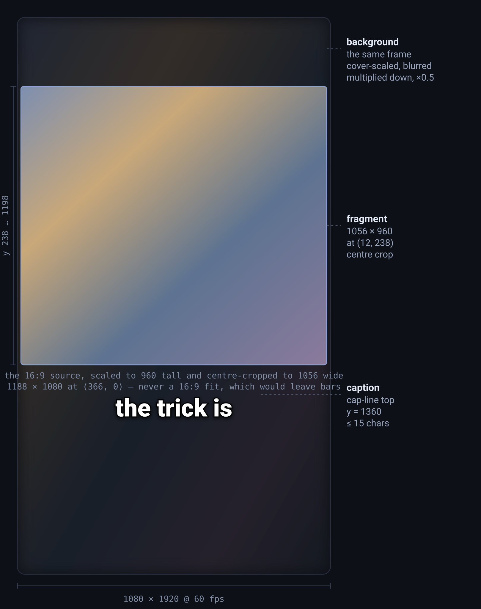
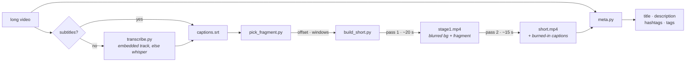

<div align="center">

# long-to-short

**Point it at a long video — with subtitles or without. Get back a finished vertical short: captions burned in, audio untouched, upload metadata written.**

A [Claude Code](https://claude.com/claude-code) skill, and four scripts you can also just run by hand.

[](LICENSE)
[](https://www.python.org/)
[](https://ffmpeg.org/)
[](https://claude.com/claude-code)



</div>

---

## What it does

You have an hour-long video. You want a 20-second vertical clip out of it that
looks deliberate, not like a crop someone did in a hurry.

**You do not need a subtitle file.** Most people pointing at a long video do not
have one, so the kit asks once and then makes it: an embedded text track if the
file already carries one (exact, two seconds), and speech recognition if it does
not (minutes, on CPU, on your own machine — no API key and nothing uploaded).

```
1080×1920 · 60 fps · H.264 + AAC
┌──────────────────────────┐
│  the fragment,           │   cover-scaled to the canvas,
│  blurred and darkened    │   blurred, multiplied by 0.5
│  ┌────────────────────┐  │
│  │                    │  │   the fragment, centre-cropped,
│  │     the fragment   │  │   above the middle — 1056×960 at (12,238)
│  │                    │  │
│  └────────────────────┘  │
│                          │
│      the trick is        │   animated captions, burned in,
│                          │   one short phrase at a time
└──────────────────────────┘
```

The captions are not a subtitle track — they are rendered frames, so they look
the same everywhere the video is played, and they are cut to **one short phrase
at a time** rather than a whole sentence.

**The metadata is part of the deliverable.** Title, description, hashtags and a
tag block come out of the same run, and the description is checked against the
video's own captions so it cannot ship as a transcript of the narration.

## Install

```bash
git clone https://github.com/maricoree/long-to-short-skill
cd long-to-short-skill
pip install -r requirements.txt      # numpy, Pillow
```

You also need **ffmpeg and ffprobe on your PATH**.

If your video has no subtitles and none embedded, add a transcription backend —
this is the only optional dependency in the kit:

```bash
pip install faster-whisper           # CTranslate2, no torch, int8 on CPU
```

To use it as a Claude Code skill, copy the folder into your skills directory:

```bash
# macOS / Linux
./install.sh

# Windows
.\install.ps1
```

That places it at `~/.claude/skills/long-to-short`, where Claude Code picks it
up automatically. Then just ask: *"make a short out of this video"* — and point
at the video and the `.srt`.

## Quick start

```bash
# 0 — no subtitles? see what the file already carries, then make the SRT
python tools/transcribe.py long.mp4 --list-streams
python tools/transcribe.py long.mp4 --out captions.srt

# 1 — find the offset and a fragment worth cutting
python tools/pick_fragment.py long.mp4 captions.srt --top 25

# 2 — check both ends land in a silence before you render anything
python tools/pick_fragment.py long.mp4 captions.srt --check 146.40 23.30

# 3 — render (two passes, ~35 s)
python tools/build_short.py --src long.mp4 --srt captions.srt \
       --t0 146.40 --dur 23.30 --cap-shift 1.00 --out short.mp4

# 4 — write and check the upload metadata
python tools/meta.py --title "…" --desc-file desc.txt --tags "…" \
       --srt captions.srt --t0 146.40 --dur 23.30 --out metadata.txt
```

Step 1 prints something like this, and every number in it is load-bearing:

```
video 3621.4 s | 812 cues | speech -9 dBFS | threshold -40 dBFS | 64 gaps >= 0.22 s

SRT offset -- fraction of cue starts landing in a silence:
  +1.00 s   781/812  (96%)
  +0.95 s   780/812  (96%)
  +1.05 s   779/812  (96%)
  at offset 0.00: 6%
  -> cues run +1.00 s relative to the audio; pass --cap-shift +1.00
```

**That offset is the whole reason captions "run fast."** It is almost never
taste — the cue file was authored ahead of the speaker, by a constant. The test
is not the 96%; it is the 96% against the **6% at offset zero**.

## When there are no subtitles

Most people pointing at a long video do not have an `.srt`, and "go and make
one" is not an answer. `transcribe.py` makes it:

```bash
python tools/transcribe.py long.mp4 --list-streams   # what is already in the file?
python tools/transcribe.py long.mp4 --out caps.srt   # make one
```

If you use the kit as a skill, Claude asks two things before it starts — whether
you have a subtitle file or want one made, and how hard to try if it is making
one — in a single round, then never asks again. The second question is put in
minutes and megabytes rather than model names, because the trade is Claude's
time, not yours. There is **no faster tier**: measured on a 6-core desktop CPU,
`tiny`, `base` and `small` take about the same time on the same file — 71 s /
90 s / 72 s for the same 397 s of audio, so `base` is the slowest of the three.
A smaller model buys a smaller download, not a shorter wait.

| | flag | costs | for |
|---|---|---|---|
| the default | `--model small` | 464 MB the first time, nothing after | clean narration, one speaker |
| hard audio | `--model medium` | 1.5 GB the first time, and slower | accents, crosstalk, music under speech |

`tiny` is deliberately not on that list — see below.

| the file has | what happens | cost |
|---|---|---|
| a text subtitle track | extracted with ffmpeg — the author's own timings, untouched | ~2 s |
| a bitmap track (PGS, VobSub, DVB) | nothing can be done with ffmpeg; that is OCR | — |
| nothing | faster-whisper, int8, on your own CPU | minutes |

Nothing is uploaded and no key is needed — an hour of audio is CPU work on your
own machine. `--model small` is the default and the right default; `--model
medium` is slower and better on hard audio or heavy accents. `base` and `tiny`
sit below the default: they download less (141 MB and 75 MB), they are not
faster, and `tiny` is worse at picking the language. `--lang ru` skips language
detection and beats it. Measured on a 6-core desktop CPU: `small` runs at about
5.5x realtime, so an hour of video is roughly ten minutes of waiting, and a slow
laptop is two to three times that. It prints its estimate before it starts and a
percentage while it runs, so a long file is never a black box.

**The first run downloads the model.** Nothing is fetched unless speech
recognition is actually needed — a text subtitle track or a supplied `.srt`
costs no download. When it is needed, the weights come from HuggingFace once and
are cached in `~/.cache/huggingface/hub` from then on. No account or token is
required, which also means an unauthenticated, rate-limited fetch: measured at
about 1 MB/s, so the default `small` is 464 MB and about eight minutes before
transcription starts. `tiny` is 75 MB, `base` 141 MB, `medium` 1.5 GB,
`large-v3` 2.9 GB. Set `HF_TOKEN` if you have one: the fetch is unauthenticated
precisely because no token is required, and anonymous traffic is rate-limited.

That download is **silent** — `huggingface_hub` only draws its progress bar on a
terminal, so run by an agent or piped into a log it shows nothing at all and
looks like a hang. The tool therefore prints the size, the cache path, and
whether the weights are already there, so the wait is never a guess.

**Do not drop to `tiny` to save that time.** The language detector goes first,
and a wrong language does not blur the transcript, it replaces it: on clean
English narration `tiny` called it Russian at p=0.69 and returned Cyrillic
transliteration of English sounds — over a whole 397 s file, every cue of it.

**No model size is safe from that, and neither is a short file.** On that same
397 s file `base` said Latvian at p=0.40 and `small` said Russian at p=0.31 —
and a 20 s cut of that same audio was still misread, `ru` at p=0.26, so length
is not the variable. Forcing `--lang en` gave clean correct English at either
size: the audio was never ambiguous, only the detector was. So when you can name
the language, pass `--lang` — it skips detection and beats it. When you cannot,
read the confidence: the tool calls out anything below 0.70, and that number is
the detector shrugging rather than deciding. If the text comes out in the wrong
language, re-run with `--lang en --force` (the tool will not overwrite an
existing `.srt` without `--force`).

Whisper also invents text where there is no speech — over music, over silence,
and worst of all in loops — so segments are dropped on the model's own
confidence, on boilerplate, and on immediate self-repetition, and **every drop
is printed with its time and its reason**. A filter that drops things silently
is a filter nobody can debug.

**A transcript made here has no offset to find.** That matters, because the next
step spends its whole time measuring one. A file a human authored runs ahead of
the speaker by a constant — that is what "the captions run fast" is — but a file
made here is timed off this video's own audio, so expect `pick_fragment.py` to
report about `0.00` and leave `--cap-shift` alone. A weak reading is the
expected answer here, not a discovery, and not a reason to hunt for a shift that
is not there.

## The tools

| tool | answers | cost |
|---|---|---|
| `transcribe.py <video> --list-streams` | does this file already carry subtitles, and in what language | ~2 s |
| `transcribe.py <video>` | the missing SRT — an embedded track if there is one, else speech recognition | 2 s, or minutes |
| `pick_fragment.py <video> <srt>` | the SRT offset, the silence gaps, and every unused 15-30 s window with its opening phrase | ~10 s |
| `pick_fragment.py … --check T0 DUR` | are both ends in a silence, are any cues cut into, how many caption lines | ~10 s |
| `build_short.py --src … --t0 … --dur … --out …` | the finished MP4 | ~35 s |
| `meta.py --title … --desc-file … --tags …` | the metadata block, field limits, the echo check | <1 s |

Every tool takes `--help`. `build_short.py` renders in two passes and can run
either one alone: `--stage1-only` writes the composition with no captions, and
`--caps-only` re-burns captions onto an existing one — **15 s instead of 35**,
so every caption-only fix (a shift, a hold, a re-split) uses it.



## The look, and how to change it

**One look, settled once.** Send a reference — a screenshot of the frame you
want, or a short to match — and it is measured and used silently. Don't send
one, and the skill asks a single question before the first render, then never
asks again for that session. It will not quietly hand you someone else's format
and let you assume that was the only option.

The geometry lives in **`presets/default.json`**, not in the code. Every key in
it can be overridden, and only the keys you change need to be present:

```json
{
  "main":     { "x": 12, "y": 238, "w": 1056, "h": 960 },
  "bg":       { "blur": 6.0, "darken": 0.5 },
  "captions": { "font_px": 80, "chars": 15, "min_hold": 0.70, "top": 60 }
}
```

```bash
python tools/build_short.py … --preset presets/mine.json
python tools/build_short.py … --canvas 720x1280      # scales the whole look
python tools/build_short.py … --font /path/to/Font-Black.otf
```

`--canvas` scales uniformly, and a canvas of a **different aspect is an error
rather than a silent stretch** — squashing the fragment is the one thing the
whole layout is built to avoid.

Fonts are found by searching the platform's font directories for a heavy
display face (Creato Display, Anton, Arial Black, Impact, Montserrat Black, …).
Pin one with `--font`, a preset's `"font"` key, or `$LONG_TO_SHORT_FONT`.

### Deriving a look from a reference

If you have a screenshot of the frame you want, **one scale factor settles every
edge at once** — do not estimate them one by one.

A 1080×1920 canvas shown at 474 px wide is 843 px tall. If your screenshot is
820 px tall, it is that canvas with a few px trimmed, so `canvas_y = shot_y ×
1080/474`, and the same factor for x. Run the numbers once, write a preset, and
every fragment after that is a one-line render.

<details>
<summary>Worked example — where the shipped preset's numbers came from</summary>

<br>

- The fragment window measured `shot y 104..527, x 5..471` → 1062×963 at
  (11,237) → **1056×960 at (12,238)**, aspect 1.103. That is **not a 16:9 fit** —
  a 16:9 fit at 1056 wide would be 594 tall. It is the source scaled to the
  window's *height* and **centre-cropped** to its width.
- Caption ink rows measured 597..622 → **cap-line top at canvas 1360**. Ink
  height 26 px × 2.2776 ≈ 59 px, and 59 / 0.73 em ≈ **80 px font**.
- Only two words were on screen in the reference, which proves the look reveals
  **one short phrase at a time**, not a whole SRT cue.

The tool derives the source crop from the window's aspect, so a 4:3 or a
vertical source works without touching the preset.

</details>

## What it deliberately does not do

This project has a section for *not* automating things, because each of these
was tried and cost more than it returned:

> NCC / image correlation / ideal-geometry search / automatic parameter
> optimisation / long comparison loops / per-frame comparison of a whole clip /
> re-analysing timecodes already found / generating new images / hunting the
> internet for originals / writing a new verification script per doubt.

When the answer is already in front of you — a frame you can look at, a number
the tool printed — look at it. Do not build a machine to look at it for you.

## Four things that will bite you

**Darkening is a multiply, never a brightness offset.** `out = in × 0.5` is
`colorchannelmixer=rr=0.5:gg=0.5:bb=0.5`. `eq=brightness=-0.16` looks
equivalent and is *subtractive* — 41 levels off every channel — and on a night
scene sitting at 20-50 it crushes the background to a measured 0-8, i.e. pure
black. When a background looks too dark, this is the bug to check first.

**A `min_hold` that does not fit beats the sync.** If
`n_lines × min_hold > duration`, every line comes out exactly `min_hold` long,
the track becomes a rigid grid, it drifts off the narration and pushes the first
line before the fragment even starts. `build_short.py` checks this and says so.

**An end that lands in speech is a word cut in half**, and no numeric check on
the render will see it. That is why `--check` exists and why both ends must
report a silence.

**`-fps_mode passthrough` is not optional** when you grab a frame strip to
review: without it ffmpeg CFR-pads the `select` output and you review the same
frame six times while believing you checked six.

## Requirements

- **ffmpeg** and **ffprobe** on `PATH`
- **Python 3.8+** with `numpy` and `Pillow` (no OpenCV)
- A heavy display font — the search falls back to whatever your system has
- **Only when the video has no subtitles at all:** `faster-whisper`
  (`pip install faster-whisper`). It is deliberately *not* in
  `requirements.txt` — nothing else here needs it, and it downloads a model on
  first use. A GPU is used if there is one and the CUDA libraries actually
  load; if they do not, it says so and falls back to the CPU rather than
  failing.

## Licence

MIT — see [LICENSE](LICENSE). Use it, change it, ship it, sell it; just keep the
copyright notice with the source.
